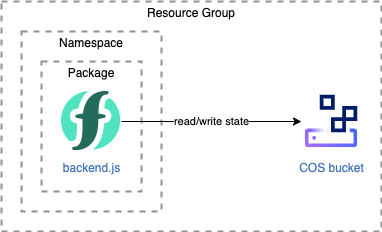

# A serverless backend for Terraform

Terraform offers several [backend types](https://www.terraform.io/docs/language/settings/backends/index.html). One of them is the [**http**](https://www.terraform.io/docs/language/settings/backends/http.html) backend which stores Terraform states using a REST client.

This project provides an implementation of the REST backend using serverless [IBM Cloud Functions](https://cloud.ibm.com/functions/) and [IBM Cloud Object Storage (COS)](https://cloud.ibm.com/catalog/services/cloud-object-storage) with **optional [state locking](https://www.terraform.io/docs/language/state/locking.html)** and **versioning** of Terraform states.

## Step 1 - Prepare the backend

This first step creates:
- a resource group,
- a COS instance with a bucket,
- Cloud Functions namespace, package and action.

It uses terraform to create the resources :)



1. Change to the step directory
   ```
   cd 010-prepare-backend
   ```
1. Copy the terraform configuration
   ```
   cp terraform.tfvars.template terraform.tfvars
   ```
1. Edit `terraform.tfvars` to match your environment
1. Create the resources
   ```
   terraform init
   terraform apply
   ```

   > It creates the resources and generates a `backend.env` file in 020-use-backend with the backend address and password.

## Step 2 - Test the backend

1. Change to the step directory
   ```
   cd 020-use-backend
   ```
1. Load the backend configuration variables
   ```
   source backend.env
   ```
1. Test the backend
   ```
   terraform init
   terraform apply
1. In IBM Cloud console,
   - go to the COS service instance,
   - select the bucket
   - find the `dev.tfstate` under `states/named`

## Advanced configuration

You can configure the generated `backend.env` to suit your needs by changing the value of the `env` and `versioning` parameters or commenting the lock/unlock address to disable locking:

```
# TF_HTTP_ADDRESS points to the Cloud Functions action implementing the backend.
# It is reused for locking implementation too.
#
# env: name for the terraform state, e.g mystate, us/south/staging (.tfstate will be added automatically)
# versioning: set to true to keep multiple copies of the states in the storage
export TF_HTTP_ADDRESS="https://us-south.functions.cloud.ibm.com/api/v1/web/1234-5678/serverless-terraform-backend-package/backend?env=dev&versioning=true"
export TF_HTTP_PASSWORD="<COS-API-KEY>"

# comment the following variables to disable locking
export TF_HTTP_LOCK_ADDRESS=$TF_HTTP_ADDRESS
export TF_HTTP_UNLOCK_ADDRESS=$TF_HTTP_ADDRESS
```

## License

This project is licensed under the Apache License Version 2.0 (http://www.apache.org/licenses/LICENSE-2.0).
