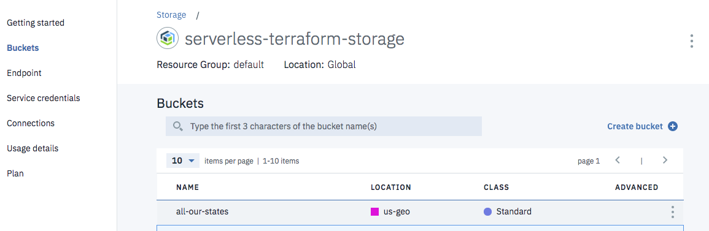
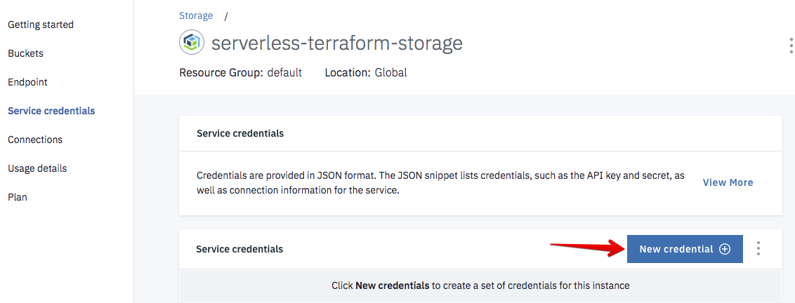

# A serverless backend for Terraform

Terraform offers several [backend types](https://www.terraform.io/docs/backends/types/index.html). One of them is the [**http**](https://www.terraform.io/docs/backends/types/http.html) backend which stores Terraform states using a REST client.

This project provides an implementation of the REST backend using serverless [IBM Cloud Functions](https://console.bluemix.net/openwhisk) and [IBM Cloud Object Storage](https://console.bluemix.net/catalog/services/cloud-object-storage) with **optional [state locking](https://www.terraform.io/docs/state/locking.html)** and **versioning** of Terraform states.

## Prepare the backend

### Create Cloud Object Storage

1. Go to [IBM Cloud console](https://console.bluemix.net) and create a [Cloud Object Storage](https://console.bluemix.net/catalog/services/cloud-object-storage) service instance

1. Create a bucket where Terraform states will be saved

   

1. Create service credentials

   

1. Make note of the available COS API endpoint, you will need to specific one later

   

### Deploy the serverless backend

1. Copy [*actions/template.local.env*](./actions/template.local.env) to *actions/local.env*

   ```sh
   cp actions/template.local.env actions/local.env
   ```

1. Edit *actions/local.env* and fill in the blanks with values from the Cloud Object Storage dashboard and credentials

1. Deploy the serverless backend action

   ```sh
   cd actions
   ./deploy --install
   ```

1. Expose the action with API Gateway

   ```sh
   cd actions
   ./deploy --installApi
   ```

1. Make note of the API Gateway endpoint. It looks like https://service.us.apiconnect.ibmcloud.com/gws/apigateway/api/abcdefabecdef0192837465/terraform/1/backend

## Configure Terraform

1. Edit `terraform/backend.tf`

1. Set **address** to the API Gateway endpoint

   > Use query parameters in the address to set a specific **env** name for your state or to enable **versioning**. As example this address would use *us/south/staging* as the key to persist the state and will enable *versioning*: `https://service.us.apiconnect.ibmcloud.com/gws/apigateway/api/abcdefabecdef0192837465/terraform/1/backend?env=us/south/staging&versioning=true`.

1. If you want to enable locking, uncomment **lock_address** and **unlock_address** and set their value to the same as **address**

1. Set **password** to the Cloud Object Storage *apikey* value found in the service credentials

1. Save

## Use Terraform

1. Initialize Terraform

   ```sh
   cd terraform   
   terraform init
   ```

1. Look at the plan

   ```sh
   terraform plan
   ```

1. Apply changes

   ```sh
   terraform apply
   ```

1. Look at the bucket content in Cloud Object Storage dashboard. You should see the state file.

1. Modify `main.tf` by changing the content of the file created by Terraform

1. Plan 

   ```sh
   terraform plan
   ```

1. Apply

   ```sh
   terraform apply
   ```

## Using Cloud Object Storage as a backend

As a side note to this project, there is also the option to use Cloud Object Storage as a [backend](https://www.terraform.io/docs/backends/types/s3.html) through its S3 compatibility - however with no locking or versioning.

1. Create Cloud Object Storage and a bucket

1. Create credentials but make sure to set **Inline Configuration Parameters (Optional)** field: **{"HMAC":true}** as described in [this section](https://console.bluemix.net/docs/services/cloud-object-storage/iam/service-credentials.html#service-credentials). This will generate the access key and secret key needed by the S3 backend.

1. Configure your backend  

   ```sh
   terraform {
     backend "s3" {
       bucket                      = "terraforming"
       key                         = "global.tfstate"
       region                      = "us-geo"
       skip_region_validation      = true
       skip_credentials_validation = true
       skip_get_ec2_platforms      = true
       skip_requesting_account_id  = true
       skip_metadata_api_check     = true
       endpoint                    = "s3-api.us-geo.objectstorage.softlayer.net"
       access_key                  = "<from-credentials>"
       secret_key                  = "<from-credentials>"
     }
   }
   ```

## License

This project is licensed under the Apache License Version 2.0 (http://www.apache.org/licenses/LICENSE-2.0).
